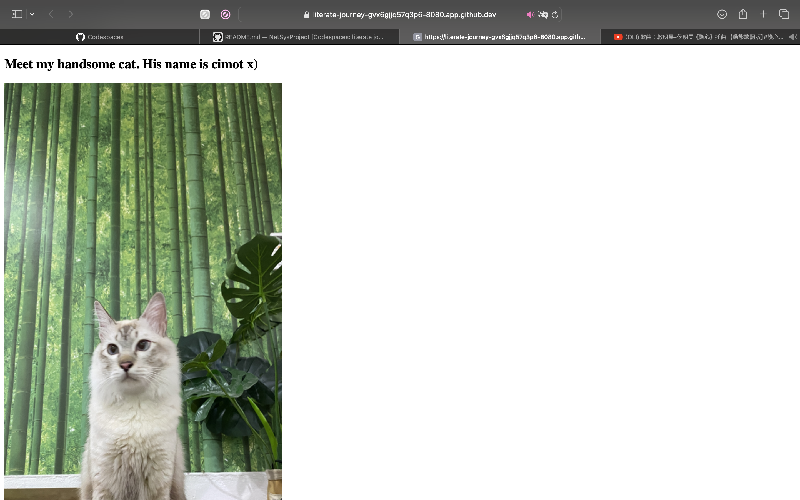

# Net&Sys Assignment: Running Containers for Application Development

Group Name: __Dark Phoenix__ 

Team Mates:
1. __Irdina Batrisyia Binti Nor Azli__  __2117188__
2. __Sayyidah Nafisah Binti Johari__  __2118242__

## Rules
1. You are allowed to have **3 group** members.
2. When you complete the assignment, make sure to submit the repository link of your cloned project. Make sure all the files are as what you aspect in your repository. 
3. Answer all questions in the **README.md**, in your own repository. Either use the online VSCode, terminal or github to edit. Answers are expected where you see __Fill answer here__.
4. Learn how to use markdown. https://www.w3schools.io/file/markdown-introduction/

## Forking this project repository
1. First thing you need in doing this assignment is to have a github account. Make sure to sign up at https://www.github.com
2. The second thing you need is to fork the Net&Sys Assignment repository in your own github account. 

    1. Go to https://github.com/ZainabBashi/NatSysProject and click fork to copy the project into your own repository
    2. Make sure that the new fork is now in your own repository

***Questions:***

1. What is the link of the fork Net&Sys Assignment in your repository. ***(1 mark)*** __https://github.com/ird1natris/NetSysProject__.
2. How many files and folders are in this repository. ***(1 mark)*** __2 files and 1 folder__.


## Exploring github codespaces

1. The next thing that we will be doing is exploring codespaces. First of all, read about codespaces https://docs.github.com/en/codespaces/overview#what-is-a-codespace
2. Then go to the link https://github.com/codespaces and we shall start a new codespace.  
3. Click on ***New codespace***.
4. Choose your own Net&Sys Assignment repository to start your codespace.

 

5. Once you have created you codespace, you will see the following. You might already be familiar with this, since it will look similar to VSCode. 

 

6. You will see the [README file](./README.md) file. One is a preview of how it looks like on the web, and the other is the editing view in markdown language. 
7. Edit the [README file](./README.md). Make sure you have your group details correct, ie, group name and team members along with their matric Numbers. 
8. Once you have finish editing, click File->Save or ***ctrl-s*** to save it. 
9. After saving, you will notice an M or U next to your file. You will need to commit any changes, whenever you make changes so that it is uploaded to the github repository. 

 

10. Click on the source control, hint: its on the left side panel, and it will list down the files that have been modified or updated. Click on commit. It will then ask you "Would you like to stage all your changes and commit them directly?" Just say yes, and a new tab will appear. Type a message to log what you have done, and click on the check mark. 

 

11. After that, sync the changes to the main repository. 
12. Make sure to commit and sync your files to the main repository, or else, your work will be lost since it is not saved into the main repository when you submit your project.

***Questions:***

1. What is default OS used to run the virtual environment for codespaces. ***(1 mark)*** __Ubuntu Linux__.
2. What are the two options of RAM, disk and vcpu configuration you can have in running codespaces . ***(1 mark)*** __2 cores, 8 GB RAM, and 32 GB storage, up to 32 cores, 64 GB RAM, and 128 GB storage__.
3. Why must we commit and sync our current work on source control? ***(1 mark)*** __Committing and syncing work on source control ensures that all changes are saved and shared with team members, providing a backup, facilitating collaboration, and maintaining a history of changes for version control and auditing purposes__.

## Exploring the Terminal

1. Look at the TERMINAL tab. Explore and run commands according to the questions below. 
2. You can include your answers as images, or cut and paste the output here. If you are cutting and pasting your answers, wrap your answers in the codeblock clause in markdown. For example, if i run the command **whoami** the the output would look like the one below.
```bash
@joeynor ➜ /workspaces/OSProject (main) $ whoami 
codespace
```


***Questions:***

Look at the TERMINAL tab. Run the following commands and provide the output here. 

1. Run the command **pwd** . ***(1 mark)***
2. Run the command **cat /etc/passwd** . ***(1 mark)***
3. Run the command **df** . ***(1 mark)***
4. Run the command **du** . ***(1 mark)***
5. Run the command **ls** . ***(1 mark)***
6. Run the command **ls -asl** . ***(1 mark)***
7. Run the command **free -h** . ***(1 mark)***
8. Run the command **cat /proc/cpuinfo** . ***(1 mark)***
9. Run the command **top** and type **q** to quit. ***(1 mark)***
10. Run the command **uname -a**. ***(1 mark)***

```bash
@ird1natris ➜ /workspaces/NetSysProject (main) $ whoami
codespace
@ird1natris ➜ /workspaces/NetSysProject (main) $ pwd
/workspaces/NetSysProject
@ird1natris ➜ /workspaces/NetSysProject (main) $ cat /etc/passwd
root:x:0:0:root:/root:/bin/bash
daemon:x:1:1:daemon:/usr/sbin:/usr/sbin/nologin
bin:x:2:2:bin:/bin:/usr/sbin/nologin
sys:x:3:3:sys:/dev:/usr/sbin/nologin
sync:x:4:65534:sync:/bin:/bin/sync
games:x:5:60:games:/usr/games:/usr/sbin/nologin
man:x:6:12:man:/var/cache/man:/usr/sbin/nologin
lp:x:7:7:lp:/var/spool/lpd:/usr/sbin/nologin
mail:x:8:8:mail:/var/mail:/usr/sbin/nologin
news:x:9:9:news:/var/spool/news:/usr/sbin/nologin
uucp:x:10:10:uucp:/var/spool/uucp:/usr/sbin/nologin
proxy:x:13:13:proxy:/bin:/usr/sbin/nologin
www-data:x:33:33:www-data:/var/www:/usr/sbin/nologin
backup:x:34:34:backup:/var/backups:/usr/sbin/nologin
list:x:38:38:Mailing List Manager:/var/list:/usr/sbin/nologin
irc:x:39:39:ircd:/var/run/ircd:/usr/sbin/nologin
gnats:x:41:41:Gnats Bug-Reporting System (admin):/var/lib/gnats:/usr/sbin/nologin
nobody:x:65534:65534:nobody:/nonexistent:/usr/sbin/nologin
_apt:x:100:65534::/nonexistent:/usr/sbin/nologin
systemd-timesync:x:101:101:systemd Time Synchronization,,,:/run/systemd:/usr/sbin/nologin
systemd-network:x:102:103:systemd Network Management,,,:/run/systemd:/usr/sbin/nologin
systemd-resolve:x:103:104:systemd Resolver,,,:/run/systemd:/usr/sbin/nologin
messagebus:x:104:105::/nonexistent:/usr/sbin/nologin
codespace:x:1000:1000::/home/codespace:/bin/bash
sshd:x:105:65534::/run/sshd:/usr/sbin/nologin
@ird1natris ➜ /workspaces/NetSysProject (main) $ df
Filesystem     1K-blocks     Used Available Use% Mounted on
overlay         32847680 14451736  16701844  47% /
tmpfs              65536        0     65536   0% /dev
shm                65536        8     65528   1% /dev/shm
/dev/root       30298176 24219136   6062656  80% /vscode
/dev/sda1       46127956       92  43752288   1% /tmp
/dev/loop3      32847680 14451736  16701844  47% /workspaces
@ird1natris ➜ /workspaces/NetSysProject (main) $ du
1972    ./images
8       ./.git/objects/60
8       ./.git/objects/b1
12      ./.git/objects/ff
12      ./.git/objects/02
8       ./.git/objects/c6
8       ./.git/objects/4b
8       ./.git/objects/41
12      ./.git/objects/d2
8       ./.git/objects/d8
8       ./.git/objects/e7
12      ./.git/objects/2e
8       ./.git/objects/4a
8       ./.git/objects/7b
20      ./.git/objects/fb
12      ./.git/objects/b0
8       ./.git/objects/fe
12      ./.git/objects/6e
8       ./.git/objects/fa
12      ./.git/objects/1c
8       ./.git/objects/f2
8       ./.git/objects/5b
1824    ./.git/objects/pack
12      ./.git/objects/70
12      ./.git/objects/64
12      ./.git/objects/44
8       ./.git/objects/74
8       ./.git/objects/0d
8       ./.git/objects/cb
8       ./.git/objects/46
8       ./.git/objects/8e
8       ./.git/objects/58
12      ./.git/objects/f0
12      ./.git/objects/14
8       ./.git/objects/3f
12      ./.git/objects/3d
12      ./.git/objects/af
8       ./.git/objects/54
12      ./.git/objects/f6
8       ./.git/objects/8c
8       ./.git/objects/83
8       ./.git/objects/91
8       ./.git/objects/b2
8       ./.git/objects/3a
12      ./.git/objects/73
8       ./.git/objects/93
8       ./.git/objects/97
16      ./.git/objects/b6
8       ./.git/objects/a6
8       ./.git/objects/71
12      ./.git/objects/c2
8       ./.git/objects/a3
8       ./.git/objects/04
8       ./.git/objects/eb
8       ./.git/objects/1a
8       ./.git/objects/fc
8       ./.git/objects/49
8       ./.git/objects/4f
8       ./.git/objects/c3
8       ./.git/objects/81
12      ./.git/objects/72
8       ./.git/objects/45
12      ./.git/objects/a1
8       ./.git/objects/0b
8       ./.git/objects/1b
8       ./.git/objects/f9
4       ./.git/objects/info
8       ./.git/objects/52
12      ./.git/objects/89
8       ./.git/objects/20
8       ./.git/objects/ee
8       ./.git/objects/86
8       ./.git/objects/fd
8       ./.git/objects/cd
12      ./.git/objects/62
12      ./.git/objects/b5
12      ./.git/objects/e5
12      ./.git/objects/17
12      ./.git/objects/7e
12      ./.git/objects/e9
8       ./.git/objects/47
8       ./.git/objects/24
8       ./.git/objects/96
16      ./.git/objects/b9
8       ./.git/objects/ab
2620    ./.git/objects
4       ./.git/lfs/tmp
8       ./.git/lfs
4       ./.git/refs/tags
8       ./.git/refs/heads
8       ./.git/refs/remotes/origin
12      ./.git/refs/remotes
28      ./.git/refs
8       ./.git/info
8       ./.git/logs/refs/heads
8       ./.git/logs/refs/remotes/origin
12      ./.git/logs/refs/remotes
24      ./.git/logs/refs
32      ./.git/logs
64      ./.git/hooks
4       ./.git/branches
2792    ./.git
4784    .
@ird1natris ➜ /workspaces/NetSysProject (main) $ ls
README.md  images
@ird1natris ➜ /workspaces/NetSysProject (main) $ ls -asl
total 32
 4 drwxrwxrwx+ 4 codespace root  4096 May 20 14:58 .
 4 drwxr-xrwx+ 5 codespace root  4096 May 20 14:58 ..
 4 drwxrwxrwx+ 9 codespace root  4096 May 20 14:59 .git
16 -rw-rw-rw-  1 codespace root 12901 May 20 15:02 README.md
 4 drwxrwxrwx+ 2 codespace root  4096 May 20 14:58 images
@ird1natris ➜ /workspaces/NetSysProject (main) $ free -h
              total        used        free      shared  buff/cache   available
Mem:          7.7Gi       1.4Gi       201Mi       1.0Mi       6.2Gi       6.0Gi
Swap:            0B          0B          0B
@ird1natris ➜ /workspaces/NetSysProject (main) $ cat /proc/cpuinfo
processor       : 0
vendor_id       : AuthenticAMD
cpu family      : 25
model           : 1
model name      : AMD EPYC 7763 64-Core Processor
stepping        : 1
microcode       : 0xffffffff
cpu MHz         : 2445.427
cache size      : 512 KB
physical id     : 0
siblings        : 2
core id         : 0
cpu cores       : 1
apicid          : 0
initial apicid  : 0
fpu             : yes
fpu_exception   : yes
cpuid level     : 13
wp              : yes
flags           : fpu vme de pse tsc msr pae mce cx8 apic sep mtrr pge mca cmov pat pse36 clflush mmx fxsr sse sse2 ht syscall nx mmxext fxsr_opt pdpe1gb rdtscp lm constant_tsc rep_good nopl tsc_reliable nonstop_tsc cpuid extd_apicid aperfmperf pni pclmulqdq ssse3 fma cx16 pcid sse4_1 sse4_2 movbe popcnt aes xsave avx f16c rdrand hypervisor lahf_lm cmp_legacy svm cr8_legacy abm sse4a misalignsse 3dnowprefetch osvw topoext invpcid_single vmmcall fsgsbase bmi1 avx2 smep bmi2 erms invpcid rdseed adx smap clflushopt clwb sha_ni xsaveopt xsavec xgetbv1 xsaves clzero xsaveerptr rdpru arat npt nrip_save tsc_scale vmcb_clean flushbyasid decodeassists pausefilter pfthreshold v_vmsave_vmload umip vaes vpclmulqdq rdpid fsrm
bugs            : sysret_ss_attrs null_seg spectre_v1 spectre_v2 spec_store_bypass srso
bogomips        : 4890.85
TLB size        : 2560 4K pages
clflush size    : 64
cache_alignment : 64
address sizes   : 48 bits physical, 48 bits virtual
power management:

processor       : 1
vendor_id       : AuthenticAMD
cpu family      : 25
model           : 1
model name      : AMD EPYC 7763 64-Core Processor
stepping        : 1
microcode       : 0xffffffff
cpu MHz         : 2645.294
cache size      : 512 KB
physical id     : 0
siblings        : 2
core id         : 0
cpu cores       : 1
apicid          : 1
initial apicid  : 1
fpu             : yes
fpu_exception   : yes
cpuid level     : 13
wp              : yes
flags           : fpu vme de pse tsc msr pae mce cx8 apic sep mtrr pge mca cmov pat pse36 clflush mmx fxsr sse sse2 ht syscall nx mmxext fxsr_opt pdpe1gb rdtscp lm constant_tsc rep_good nopl tsc_reliable nonstop_tsc cpuid extd_apicid aperfmperf pni pclmulqdq ssse3 fma cx16 pcid sse4_1 sse4_2 movbe popcnt aes xsave avx f16c rdrand hypervisor lahf_lm cmp_legacy svm cr8_legacy abm sse4a misalignsse 3dnowprefetch osvw topoext invpcid_single vmmcall fsgsbase bmi1 avx2 smep bmi2 erms invpcid rdseed adx smap clflushopt clwb sha_ni xsaveopt xsavec xgetbv1 xsaves clzero xsaveerptr rdpru arat npt nrip_save tsc_scale vmcb_clean flushbyasid
top - 15:13:15 up 18 min,  0 users,  load average: 0.20, 0.35, 0.49
Tasks:  17 total,   1 running,  16 sleeping,   0 stopped,   0 zombie
%Cpu(s):  4.1 us,  4.2 sy,  0.0 ni, 91.5 id,  0.2 wa,  0.0 hi,  0.0 si,  0.0 st
MiB Mem :   7929.6 total,    186.3 free,   1485.3 used,   6258.0 buff/cache
MiB Swap:      0.0 total,      0.0 free,      0.0 used.   6128.2 avail Mem
 
@ird1natris ➜ /workspaces/NetSysProject (main) $ 
    PID USER      PR  NI    VIRT    RES    SHR S  %CPU  %MEM     TIME+ COMMAND                                                                                 
   2382 codespa+  20   0   21.1g 340164  43776 S   1.3   4.2   0:21.34 node                                                                                    
   3212 codespa+  20   0  726652  61544  38656 S   1.0   0.8   0:01.15 node                                                                                    
   2186 codespa+  20   0  970152 109124  42240 S   0.7   1.3   0:05.03 node                                                                                    
    776 root      20   0 1463360  86492  50304 S   0.3   1.1   0:00.17 dockerd
                                                                                 
@ird1natris ➜ /workspaces/NetSysProject (main) $ uname -a
Linux codespaces-ea28d8 6.5.0-1019-azure #20~22.04.1-Ubuntu SMP Wed Apr  3 03:28:18 UTC 2024 x86_64 x86_64 x86_64 GNU/Linux
```

11. What is the available free memory in the system. ***(1 mark)*** __The available free memory is 201 MiB__.

12. What is the available disk space mounted on /workspace. ***(1 mark)*** __The available disk space mounted on /workspace is 16,701,844 1K-blocks (approximately 16 GB)__.

13. Name the version and hardware architecture of the linux Virtual environment. ***(1 mark)*** __The version is 6.5.0-1019-azure and the hardware architecture is x86_64__.

14. What is the difference between **ls** vs **ls -asl**. ***(1 mark)*** __ls command lists the names of files and directories in the current directory while ls -asl command lists files and directories with detailed information including file type and permissions, number of hard links, owner, group, size, last modification date and time with all entries including hidden files and size in blocks__.

15. What is the TLB size of the Virtual CPU. ***(1 mark)*** __The TLB size of the Virtual CPU is 6.2 GiB__.

16. What is the CPU speed of the Virtual CPU. ***(1 mark)*** __The CPU speed of the Virtual CPU is 2445.427 MHz__.

17. What is the top running process that consumes the most CPU cycles. ***(1 mark)*** __The top running process that consumes the most CPU cycles is node with PID 2382__.

## Running your own container instance.

1. At the terminal, run a linux instance. By typing the following command. 
```
docker pull debian
docker run --detach -it debian
```
```bash
@sayyidahjohari ➜ /workspaces/NetSysProject (main) $ docker pull debian
Using default tag: latest
latest: Pulling from library/debian
c6cf28de8a06: Pull complete 
Digest: sha256:fac2c0fd33e88dfd3bc88a872cfb78dcb167e74af6162d31724df69e482f886c
Status: Downloaded newer image for debian:latest
docker.io/library/debian:latest
@sayyidahjohari ➜ /workspaces/NetSysProject (main) $ docker run --detach -it debian
6bb5c8861821b37633bc24d2e34eb62ce863349b0960d6bbd8b58be58eefc5ab
```
2. This will run the debian container. To check if the debian container is running, type
```bash
@joeynor ➜ /workspaces/OSProject (main) $ docker ps -a
CONTAINER ID   IMAGE     COMMAND   CREATED         STATUS         PORTS     NAMES
f65be1987f84   debian    "bash"    4 minutes ago   Up 4 minutes             romantic_jackson
```
```bash
@sayyidahjohari ➜ /workspaces/NetSysProject (main) $ docker ps -a
CONTAINER ID   IMAGE     COMMAND   CREATED              STATUS          PORTS     NAMES
6bb5c8861821   debian    "bash"    About a minute ago   Up 58 seconds             intelligent_keller
```

3. Keep note of the name used by your container, this is usually given random names unless you specify your own name. Now run a bash command on the container. Make sure you use the name of your container instead of the one shown here. 
```bash
docker exec -i -t romantic_jackson /bin/bash
```
```bash
@sayyidahjohari ➜ /workspaces/NetSysProject (main) $ docker exec -i -t intelligent_keller /bin/bash
root@6bb5c8861821:/# 
```
4. Create a file on the container. First you must make sure you are in the bash command prompt of the container. The container is new, and does not have any software other than the debian OS. To create a new file, you will need an editor installed. In the bash shell of the container, run the package manager apt-get to install nano text editor. 

```bash
root@f65be1987f84:~# apt-get update      

root@f65be1987f84:~# apt-get install nano

root@f65be1987f84:~# cd /root

root@f65be1987f84:~# nano helloworld.txt
```

5. Edit your helloworld.txt, create your messsage and save by typing ctrl-X. Once saved, explore using the container to see where the file is located. Then exit the shell, by typing **exit**.

```bash
root@6bb5c8861821:/# cd /root
root@6bb5c8861821:~# nano helloworld.txt
root@6bb5c8861821:~# ls
helloworld.txt
root@6bb5c8861821:~# cat helloworld.txt
Hello world! this is helloworld.txt file for assignment 3 Network & System Administration ^.^
root@6bb5c8861821:~# exit
exit
@sayyidahjohari ➜ /workspaces/NetSysProject (main) $ 
```


6. Stop the container and run **docker ps -a**, and restart the container again. Is your file in the container still available?
```bash 
@joeynor ➜ /workspaces/OSProject (main) $ docker stop romantic_jackson

@joeynor ➜ /workspaces/OSProject (main) $ docker ps -a
CONTAINER ID   IMAGE     COMMAND   CREATED          STATUS                        PORTS     NAMES
f65be1987f84   debian    "bash"    19 minutes ago   Exited (137) 18 seconds ago             romantic_jackson

@joeynor ➜ /workspaces/OSProject (main) $ docker restart romantic_jackson
```
```bash
@sayyidahjohari ➜ /workspaces/NetSysProject (main) $ docker stop intelligent_keller
intelligent_keller
@sayyidahjohari ➜ /workspaces/NetSysProject (main) $ docker ps -a
CONTAINER ID   IMAGE     COMMAND   CREATED          STATUS                        PORTS     NAMES
6bb5c8861821   debian    "bash"    10 minutes ago   Exited (137) 16 seconds ago             intelligent_keller
@sayyidahjohari ➜ /workspaces/NetSysProject (main) $ docker restart intelligent_keller
intelligent_keller
@sayyidahjohari ➜ /workspaces/NetSysProject (main) $ docker ps -a
CONTAINER ID   IMAGE     COMMAND   CREATED          STATUS         PORTS     NAMES
6bb5c8861821   debian    "bash"    11 minutes ago   Up 2 seconds             intelligent_keller
@sayyidahjohari ➜ /workspaces/NetSysProject (main) $ docker exec -i -t intelligent_keller /bin/bash
root@6bb5c8861821:/# cd /root
root@6bb5c8861821:~# ls
helloworld.txt
```
7. Stop the container and delete the container. What happened to your helloworld.txt?

```bash 
@joeynor ➜ /workspaces/OSProject (main) $ docker stop romantic_jackson

@joeynor ➜ /workspaces/OSProject (main) $ docker ps -a
CONTAINER ID   IMAGE     COMMAND   CREATED          STATUS                        PORTS     NAMES
f65be1987f84   debian    "bash"    19 minutes ago   Exited (137) 18 seconds ago             romantic_jackson

@joeynor ➜ /workspaces/OSProject (main) $ docker rm romantic_jackson
```

```bash
@sayyidahjohari ➜ /workspaces/NetSysProject (main) $ docker stop intelligent_keller
intelligent_keller
@sayyidahjohari ➜ /workspaces/NetSysProject (main) $ docker ps -a
CONTAINER ID   IMAGE     COMMAND   CREATED          STATUS                                PORTS     NAMES
6bb5c8861821   debian    "bash"    15 minutes ago   Exited (137) Less than a second ago             intelligent_keller
@sayyidahjohari ➜ /workspaces/NetSysProject (main) $ docker rm intelligent_keller
intelligent_keller
@sayyidahjohari ➜ /workspaces/NetSysProject (main) $ docker ps -a
CONTAINER ID   IMAGE     COMMAND   CREATED   STATUS    PORTS     NAMES
```
***Questions:***

1. Are files in the container persistent. Why not?. ***(1 mark)*** __Files in the container is not persistent by default. This is because Codespace container can be stopped, restarted and recreated which will result in the loss of any changes made within the container.__.
2. Can we run two, or three instances of debian linux? . ***(1 mark)*** __We cannot run multiple instances of debian linux__.

## Running your own container with persistent storage

1. In the previous experiment, you might have notice that containers are not persistent. To make storage persistent, you will need to mount them. 
At the terminal, create a new directory called **myroot**, and run a instance of debian linux and mount myroot to the container. Find out the exact path of my root, and mount it as the root folder in the debian container. 
2. Create a file in /root on the container, the files should also appear in myroot of your host VM.

```bash 
@joeynor ➜ /workspaces/OSProject (main) $ mkdir myroot
@joeynor ➜ /workspaces/OSProject (main) $ cd myroot/
@joeynor ➜ /workspaces/OSProject/myroot (main) $ pwd
/workspaces/OSProject/myroot

@joeynor ➜ /workspaces/OSProject/myroot (main) $ docker run --detach -it -v /workspaces/OSProject/myroot:/root debian
```
```bash
@sayyidahjohari ➜ /workspaces/NetSysProject (main) $ mkdir myroot
@sayyidahjohari ➜ /workspaces/NetSysProject (main) $ cd myroot/
@sayyidahjohari ➜ /workspaces/NetSysProject/myroot (main) $ pwd
/workspaces/NetSysProject/myroot
@sayyidahjohari ➜ /workspaces/NetSysProject/myroot (main) $ docker run --detach -it -v /workspaces/NetSysProject/myroot:/root debian
e32ec602839531fe896d530763bca1c38137fc1710b38d7195e49e7f4101e34d
```

***Questions:***

1. Check the permission of the files created in myroot, what user and group is the files created in docker container on the host virtual machine? . ***(2 mark)*** __To check the permission of the file, I used command ```ls -l```. The result indicates that the files belong to user root and group root. Based on the permission, owner, group and others can read and write but cannot execute the file.__.
```bash
@sayyidahjohari ➜ /workspaces/NetSysProject/myroot (main) $ ls -l -a
total 12
drwxrwxrwx+ 2 codespace codespace 4096 May 21 09:21 .
drwxrwxrwx+ 5 codespace root      4096 May 21 09:18 ..
-rw-rw-rw-  1 root      root        67 May 21 09:21 helloworld.txt
```
2. Can you change the permission of the files to user codespace.  You will need this to be able to commit and get points for this question. ***(2 mark)***
```bash
//use sudo and chown
sudo chown -R codespace:codespace myroot

```
*** __After changing the owner of the folder to codespace using command ```sudo chown -R codespace:codespace myroot```, I can change the permission of the files to user codespace. Commands below is the result before and after I change the owner of the folder. I also have changed the permission of the files to user codespace after the owner changed__.***

Before:
```bash
@sayyidahjohari ➜ /workspaces/NetSysProject/myroot (main) $ ls -l
total 4
-rw-rw-rw- 1 root root 67 May 21 09:21 helloworld.txt
@sayyidahjohari ➜ /workspaces/NetSysProject/myroot (main) $ chmod u+x helloworld.txt
chmod: changing permissions of 'helloworld.txt': Operation not permitted
@sayyidahjohari ➜ /workspaces/NetSysProject/myroot (main) $ 

```
After:
__As shown below, the permission for helloworld.txt has been changed to executable file for user codespace.
```bash
@sayyidahjohari ➜ /workspaces/NetSysProject/myroot (main) $ cd ..
@sayyidahjohari ➜ /workspaces/NetSysProject (main) $ sudo chown -R codespace:codespace myroot
@sayyidahjohari ➜ /workspaces/NetSysProject (main) $ cd myroot
@sayyidahjohari ➜ /workspaces/NetSysProject/myroot (main) $ ls -l
total 4
-rw-rw-rw- 1 codespace codespace 67 May 21 09:21 helloworld.txt
@sayyidahjohari ➜ /workspaces/NetSysProject/myroot (main) $ chmod u+x helloworld.txt
@sayyidahjohari ➜ /workspaces/NetSysProject/myroot (main) $ ls -l
total 4
-rwxrw-rw- 1 codespace codespace 67 May 21 09:21 helloworld.txt
```


## You are on your own, create your own static webpage

1. Create a directory called webpage in your host machine
2. Inside the directory, create a page index.html, with any content you would like
```bash
@sayyidahjohari ➜ /workspaces/NetSysProject (main) $ mkdir webpage
@sayyidahjohari ➜ /workspaces/NetSysProject (main) $ cd webpage
@sayyidahjohari ➜ /workspaces/NetSysProject/webpage (main) $ touch index.html
```
3. Then, run the apache webserver and mount the webpage directory to it. Hint:
```bash
## the -p 8080:80 flag points the host port 8080 to the container port 80

docker run --detach -v /workspaces/OSProject/webpage:/usr/local/apache2/htdocs/ -p 8080:80 httpd
```
```bash
@sayyidahjohari ➜ /workspaces/NetSysProject/webpage (main) $ pwd
/workspaces/NetSysProject/webpage
@sayyidahjohari ➜ /workspaces/NetSysProject/webpage (main) $ docker run --detach -v /workspaces/NetSysProject/webpage:/usr/local/apache2/htdocs/ -p 8080:80 httpd
Unable to find image 'httpd:latest' locally
latest: Pulling from library/httpd
09f376ebb190: Pull complete 
dab55b4abfc3: Pull complete 
4f4fb700ef54: Pull complete 
1a6d0283f224: Pull complete 
1abf9110528c: Pull complete 
7bacb8f85f3a: Pull complete 
Digest: sha256:43c7661a3243c04b0955c81ac994ea13a1d8a1e53c15023a7b3cd5e8bb25de3c
Status: Downloaded newer image for httpd:latest
281de1dfcefd07006d9e573153d71035ca5846bb726ac4d2c036fecd55e4d227
```



4. If it works, codespace will trigger a port assignment and provide a URL for you to access your webpage like the one below.

 


5. You can also see the Port in the **PORTS** tab, next to the terminal tab.

6. You can then access your website by adding an index.html towards the end of your url link, like the one below. 

 

***Questions:***

1. What is the permission of folder /usr/local/apache/htdocs and what user and group owns the folder? . ***(2 mark)*** __Based on the result in command below, owner, group and others can read and write all file but cannot execute them. The folder owned by ```user id 1000``` and ```group id 1000``` which belongs to ```codespace```__.
2. What port is the apache web server running. ***(1 mark)*** __port 80__ 
3. What port is open for http protocol on the host machine? ***(1 mark)*** __port 8080__

```bash
@sayyidahjohari ➜ /workspaces/NetSysProject/webpage (main) $ docker ps
CONTAINER ID   IMAGE     COMMAND              CREATED         STATUS         PORTS                                   NAMES
989cec68f5af   httpd     "httpd-foreground"   5 minutes ago   Up 5 minutes   0.0.0.0:8080->80/tcp, :::8080->80/tcp   musing_yalow
@sayyidahjohari ➜ /workspaces/NetSysProject/webpage (main) $ docker exec -it 989cec68f5af ls -l /usr/local/apache2/htdocs
total 5680
-rw-rw-rw- 1 1000 1000 2756051 May 21 11:01 cimot.JPG
-rw-rw-rw- 1 1000 1000     188 May 21 11:15 index.html
-rw-rw-rw- 1 1000 1000 3054659 May 21 12:54 ss_webpage.png
@sayyidahjohari ➜ /workspaces/NetSysProject/webpage (main) $ awk -F':' '$3 == 1000 {print $1}' /etc/passwd
codespace
@sayyidahjohari ➜ /workspaces/NetSysProject/webpage (main) $ awk -F':' '$3 == 1000 {print $1}' /etc/group
codespace
```

## Create SUB Networks

1. In docker, you can create your own private networks where you can run multiple services, in this part, we will create two networks, one called bluenet and the other is rednet
2. Run the docker create network to create you networks like the ones below
```bash
## STEP 1:
## Create Networks ##
docker network create bluenet
docker network create rednet`

## STEP 2: (automatically running)
## Create (1) Container in background called "c1" running busybox image ##
docker run -itd --net bluenet --name c1 busybox sh
docker run -itd --net rednet --name c2 busybox sh
```
```bash
@sayyidahjohari ➜ /workspaces/NetSysProject (main) $ docker network create bluenet
a13d98691d8e81b906b36df6729bfbd44dda4bb50e6672ba1a9336be4e51e90c
@sayyidahjohari ➜ /workspaces/NetSysProject (main) $ docker network create rednet
9132e65feaa8011e22ad64c1cb99b154212acf990ab546c1dbcd7d1b3d4bdf95
@sayyidahjohari ➜ /workspaces/NetSysProject (main) $ docker run -itd --net bluenet --name c1 busybox sh
Unable to find image 'busybox:latest' locally
latest: Pulling from library/busybox
ec562eabd705: Pull complete 
Digest: sha256:5eef5ed34e1e1ff0a4ae850395cbf665c4de6b4b83a32a0bc7bcb998e24e7bbb
Status: Downloaded newer image for busybox:latest
afd8c55a7aa7a58af47afaf5a51f65f18e7da4bf5bc7921b8318eeaa09746a66
@sayyidahjohari ➜ /workspaces/NetSysProject (main) $ docker run -itd --net rednet --name c2 busybox sh
a0e937ac410610f0fce8e4c2cd8a7ab51004cb2d394592d5a011197eb86f6b61
```

***Questions:***

1. Describe what is busybox and what is command switch **--name** is for? . ***(2 mark)*** __busybox or sometimes referred to as The Swiss Army Knife of Embedded Linux is a software suite that provides several UNIX utilities in a single executable file. switch **--name** is used to assign a specific name for a container in docker__.
2. Explore the network using the command ```docker network ls```, show the output of your terminal. ***(1 mark)***
```bash
@sayyidahjohari ➜ /workspaces/NetSysProject (main) $ docker network ls
NETWORK ID     NAME      DRIVER    SCOPE
a13d98691d8e   bluenet   bridge    local
c79a73f1bc91   bridge    bridge    local
a863edc11210   host      host      local
55dd010814d3   none      null      local
9132e65feaa8   rednet    bridge    local
```
3. Using ```docker inspect c1``` and ```docker inspect c2``` inscpect the two network. What is the gateway of bluenet and rednet.? ***(1 mark)*** __gateway for bluenet is ```172.18.0.1``` and gateway for rednet is ```172.19.0.1```__.
4. What is the network address for the running container c1 and c2. 
__Network address for container c1 is ```172.18.0.2``` and c2 is ```172.19.0.2```

__command for question 3 and 4:__
__c1:__
```bash
@sayyidahjohari ➜ /workspaces/NetSysProject (main) $ docker inspect c1
[
    {
        "Id": "afd8c55a7aa7a58af47afaf5a51f65f18e7da4bf5bc7921b8318eeaa09746a66",
        "Created": "2024-05-21T16:47:07.622058356Z",
        "Path": "sh",
        "Args": [],
        "State": {
            "Status": "running",
            "Running": true,
            "Paused": false,
            "Restarting": false,
            "OOMKilled": false,
            "Dead": false,
            "Pid": 2679,
            "ExitCode": 0,
            "Error": "",
            "StartedAt": "2024-05-21T16:47:08.402403027Z",
            "FinishedAt": "0001-01-01T00:00:00Z"
        },
        "Image": "sha256:65ad0d468eb1c558bf7f4e64e790f586e9eda649ee9f130cd0e835b292bbc5ac",
        "ResolvConfPath": "/var/lib/docker/containers/afd8c55a7aa7a58af47afaf5a51f65f18e7da4bf5bc7921b8318eeaa09746a66/resolv.conf",
        "HostnamePath": "/var/lib/docker/containers/afd8c55a7aa7a58af47afaf5a51f65f18e7da4bf5bc7921b8318eeaa09746a66/hostname",
        "HostsPath": "/var/lib/docker/containers/afd8c55a7aa7a58af47afaf5a51f65f18e7da4bf5bc7921b8318eeaa09746a66/hosts",
        "LogPath": "/var/lib/docker/containers/afd8c55a7aa7a58af47afaf5a51f65f18e7da4bf5bc7921b8318eeaa09746a66/afd8c55a7aa7a58af47afaf5a51f65f18e7da4bf5bc7921b8318eeaa09746a66-json.log",
        "Name": "/c1",
        "RestartCount": 0,
        "Driver": "overlay2",
        "Platform": "linux",
        "MountLabel": "",
        "ProcessLabel": "",
        "AppArmorProfile": "docker-default",
        "ExecIDs": null,
        "HostConfig": {
            "Binds": null,
            "ContainerIDFile": "",
            "LogConfig": {
                "Type": "json-file",
                "Config": {}
            },
            "NetworkMode": "bluenet",
            "PortBindings": {},
            "RestartPolicy": {
                "Name": "no",
                "MaximumRetryCount": 0
            },
            "AutoRemove": false,
            "VolumeDriver": "",
            "VolumesFrom": null,
            "ConsoleSize": [
                16,
                145
            ],
            "CapAdd": null,
            "CapDrop": null,
            "CgroupnsMode": "private",
            "Dns": [],
            "DnsOptions": [],
            "DnsSearch": [],
            "ExtraHosts": null,
            "GroupAdd": null,
            "IpcMode": "private",
            "Cgroup": "",
            "Links": null,
            "OomScoreAdj": 0,
            "PidMode": "",
            "Privileged": false,
            "PublishAllPorts": false,
            "ReadonlyRootfs": false,
            "SecurityOpt": null,
            "UTSMode": "",
            "UsernsMode": "",
            "ShmSize": 67108864,
            "Runtime": "runc",
            "Isolation": "",
            "CpuShares": 0,
            "Memory": 0,
            "NanoCpus": 0,
            "CgroupParent": "",
            "BlkioWeight": 0,
            "BlkioWeightDevice": [],
            "BlkioDeviceReadBps": [],
            "BlkioDeviceWriteBps": [],
            "BlkioDeviceReadIOps": [],
            "BlkioDeviceWriteIOps": [],
            "CpuPeriod": 0,
            "CpuQuota": 0,
            "CpuRealtimePeriod": 0,
            "CpuRealtimeRuntime": 0,
            "CpusetCpus": "",
            "CpusetMems": "",
            "Devices": [],
            "DeviceCgroupRules": null,
            "DeviceRequests": null,
            "MemoryReservation": 0,
            "MemorySwap": 0,
            "MemorySwappiness": null,
            "OomKillDisable": null,
            "PidsLimit": null,
            "Ulimits": null,
            "CpuCount": 0,
            "CpuPercent": 0,
            "IOMaximumIOps": 0,
            "IOMaximumBandwidth": 0,
            "MaskedPaths": [
                "/proc/asound",
                "/proc/acpi",
                "/proc/kcore",
                "/proc/keys",
                "/proc/latency_stats",
                "/proc/timer_list",
                "/proc/timer_stats",
                "/proc/sched_debug",
                "/proc/scsi",
                "/sys/firmware",
                "/sys/devices/virtual/powercap"
            ],
            "ReadonlyPaths": [
                "/proc/bus",
                "/proc/fs",
                "/proc/irq",
                "/proc/sys",
                "/proc/sysrq-trigger"
            ]
        },
        "GraphDriver": {
            "Data": {
                "LowerDir": "/var/lib/docker/overlay2/f7b0a88679b5f9584f792eb19128b76d1f9d53055bcf1a9879ad2445b94fc0ff-init/diff:/var/lib/docker/overlay2/500bcb02ce56ca307298cb40a7b18e7f4eab129bfccba18ac92fa0c16a60a3cf/diff",
                "MergedDir": "/var/lib/docker/overlay2/f7b0a88679b5f9584f792eb19128b76d1f9d53055bcf1a9879ad2445b94fc0ff/merged",
                "UpperDir": "/var/lib/docker/overlay2/f7b0a88679b5f9584f792eb19128b76d1f9d53055bcf1a9879ad2445b94fc0ff/diff",
                "WorkDir": "/var/lib/docker/overlay2/f7b0a88679b5f9584f792eb19128b76d1f9d53055bcf1a9879ad2445b94fc0ff/work"
            },
            "Name": "overlay2"
        },
        "Mounts": [],
        "Config": {
            "Hostname": "afd8c55a7aa7",
            "Domainname": "",
            "User": "",
            "AttachStdin": false,
            "AttachStdout": false,
            "AttachStderr": false,
            "Tty": true,
            "OpenStdin": true,
            "StdinOnce": false,
            "Env": null,
            "Cmd": [
                "sh"
            ],
            "Image": "busybox",
            "Volumes": null,
            "WorkingDir": "",
            "Entrypoint": null,
            "OnBuild": null,
            "Labels": {}
        },
        "NetworkSettings": {
            "Bridge": "",
            "SandboxID": "4fb727ce8ee764138102b2078c0ef6017e170fb8fcdefe883d233f4d0b67e837",
            "HairpinMode": false,
            "LinkLocalIPv6Address": "",
            "LinkLocalIPv6PrefixLen": 0,
            "Ports": {},
            "SandboxKey": "/var/run/docker/netns/4fb727ce8ee7",
            "SecondaryIPAddresses": null,
            "SecondaryIPv6Addresses": null,
            "EndpointID": "",
            "Gateway": "",
            "GlobalIPv6Address": "",
            "GlobalIPv6PrefixLen": 0,
            "IPAddress": "",
            "IPPrefixLen": 0,
            "IPv6Gateway": "",
            "MacAddress": "",
            "Networks": {
                "bluenet": {
                    "IPAMConfig": null,
                    "Links": null,
                    "Aliases": [
                        "afd8c55a7aa7"
                    ],
                    "NetworkID": "a13d98691d8e81b906b36df6729bfbd44dda4bb50e6672ba1a9336be4e51e90c",
                    "EndpointID": "634c69fa9bf406166d679a0bab5d0cd05c8f5c8fdc704f4f5123df0738b86614",
                    "Gateway": "172.18.0.1",
                    "IPAddress": "172.18.0.2",
                    "IPPrefixLen": 16,
                    "IPv6Gateway": "",
                    "GlobalIPv6Address": "",
                    "GlobalIPv6PrefixLen": 0,
                    "MacAddress": "02:42:ac:12:00:02",
                    "DriverOpts": null
                }
            }
        }
    }
]
```


__c2:__
```bash
@sayyidahjohari ➜ /workspaces/NetSysProject (main) $ docker inspect c2
[
    {
        "Id": "a0e937ac410610f0fce8e4c2cd8a7ab51004cb2d394592d5a011197eb86f6b61",
        "Created": "2024-05-21T16:47:19.557939131Z",
        "Path": "sh",
        "Args": [],
        "State": {
            "Status": "running",
            "Running": true,
            "Paused": false,
            "Restarting": false,
            "OOMKilled": false,
            "Dead": false,
            "Pid": 2860,
            "ExitCode": 0,
            "Error": "",
            "StartedAt": "2024-05-21T16:47:20.08293822Z",
            "FinishedAt": "0001-01-01T00:00:00Z"
        },
        "Image": "sha256:65ad0d468eb1c558bf7f4e64e790f586e9eda649ee9f130cd0e835b292bbc5ac",
        "ResolvConfPath": "/var/lib/docker/containers/a0e937ac410610f0fce8e4c2cd8a7ab51004cb2d394592d5a011197eb86f6b61/resolv.conf",
        "HostnamePath": "/var/lib/docker/containers/a0e937ac410610f0fce8e4c2cd8a7ab51004cb2d394592d5a011197eb86f6b61/hostname",
        "HostsPath": "/var/lib/docker/containers/a0e937ac410610f0fce8e4c2cd8a7ab51004cb2d394592d5a011197eb86f6b61/hosts",
        "LogPath": "/var/lib/docker/containers/a0e937ac410610f0fce8e4c2cd8a7ab51004cb2d394592d5a011197eb86f6b61/a0e937ac410610f0fce8e4c2cd8a7ab51004cb2d394592d5a011197eb86f6b61-json.log",
        "Name": "/c2",
        "RestartCount": 0,
        "Driver": "overlay2",
        "Platform": "linux",
        "MountLabel": "",
        "ProcessLabel": "",
        "AppArmorProfile": "docker-default",
        "ExecIDs": null,
        "HostConfig": {
            "Binds": null,
            "ContainerIDFile": "",
            "LogConfig": {
                "Type": "json-file",
                "Config": {}
            },
            "NetworkMode": "rednet",
            "PortBindings": {},
            "RestartPolicy": {
                "Name": "no",
                "MaximumRetryCount": 0
            },
            "AutoRemove": false,
            "VolumeDriver": "",
            "VolumesFrom": null,
            "ConsoleSize": [
                16,
                145
            ],
            "CapAdd": null,
            "CapDrop": null,
            "CgroupnsMode": "private",
            "Dns": [],
            "DnsOptions": [],
            "DnsSearch": [],
            "ExtraHosts": null,
            "GroupAdd": null,
            "IpcMode": "private",
            "Cgroup": "",
            "Links": null,
            "OomScoreAdj": 0,
            "PidMode": "",
            "Privileged": false,
            "PublishAllPorts": false,
            "ReadonlyRootfs": false,
            "SecurityOpt": null,
            "UTSMode": "",
            "UsernsMode": "",
            "ShmSize": 67108864,
            "Runtime": "runc",
            "Isolation": "",
            "CpuShares": 0,
            "Memory": 0,
            "NanoCpus": 0,
            "CgroupParent": "",
            "BlkioWeight": 0,
            "BlkioWeightDevice": [],
            "BlkioDeviceReadBps": [],
            "BlkioDeviceWriteBps": [],
            "BlkioDeviceReadIOps": [],
            "BlkioDeviceWriteIOps": [],
            "CpuPeriod": 0,
            "CpuQuota": 0,
            "CpuRealtimePeriod": 0,
            "CpuRealtimeRuntime": 0,
            "CpusetCpus": "",
            "CpusetMems": "",
            "Devices": [],
            "DeviceCgroupRules": null,
            "DeviceRequests": null,
            "MemoryReservation": 0,
            "MemorySwap": 0,
            "MemorySwappiness": null,
            "OomKillDisable": null,
            "PidsLimit": null,
            "Ulimits": null,
            "CpuCount": 0,
            "CpuPercent": 0,
            "IOMaximumIOps": 0,
            "IOMaximumBandwidth": 0,
            "MaskedPaths": [
                "/proc/asound",
                "/proc/acpi",
                "/proc/kcore",
                "/proc/keys",
                "/proc/latency_stats",
                "/proc/timer_list",
                "/proc/timer_stats",
                "/proc/sched_debug",
                "/proc/scsi",
                "/sys/firmware",
                "/sys/devices/virtual/powercap"
            ],
            "ReadonlyPaths": [
                "/proc/bus",
                "/proc/fs",
                "/proc/irq",
                "/proc/sys",
                "/proc/sysrq-trigger"
            ]
        },
        "GraphDriver": {
            "Data": {
                "LowerDir": "/var/lib/docker/overlay2/1f2fd143768ad839be2d92d32dd61f8b45a964ed2c7f7c3dea673b4cdc8c2851-init/diff:/var/lib/docker/overlay2/500bcb02ce56ca307298cb40a7b18e7f4eab129bfccba18ac92fa0c16a60a3cf/diff",
                "MergedDir": "/var/lib/docker/overlay2/1f2fd143768ad839be2d92d32dd61f8b45a964ed2c7f7c3dea673b4cdc8c2851/merged",
                "UpperDir": "/var/lib/docker/overlay2/1f2fd143768ad839be2d92d32dd61f8b45a964ed2c7f7c3dea673b4cdc8c2851/diff",
                "WorkDir": "/var/lib/docker/overlay2/1f2fd143768ad839be2d92d32dd61f8b45a964ed2c7f7c3dea673b4cdc8c2851/work"
            },
            "Name": "overlay2"
        },
        "Mounts": [],
        "Config": {
            "Hostname": "a0e937ac4106",
            "Domainname": "",
            "User": "",
            "AttachStdin": false,
            "AttachStdout": false,
            "AttachStderr": false,
            "Tty": true,
            "OpenStdin": true,
            "StdinOnce": false,
            "Env": null,
            "Cmd": [
                "sh"
            ],
            "Image": "busybox",
            "Volumes": null,
            "WorkingDir": "",
            "Entrypoint": null,
            "OnBuild": null,
            "Labels": {}
        },
        "NetworkSettings": {
            "Bridge": "",
            "SandboxID": "813e427f4a77bbf65e4435455de325d90491ba390e00325e5f3f3db6ef050528",
            "HairpinMode": false,
            "LinkLocalIPv6Address": "",
            "LinkLocalIPv6PrefixLen": 0,
            "Ports": {},
            "SandboxKey": "/var/run/docker/netns/813e427f4a77",
            "SecondaryIPAddresses": null,
            "SecondaryIPv6Addresses": null,
            "EndpointID": "",
            "Gateway": "",
            "GlobalIPv6Address": "",
            "GlobalIPv6PrefixLen": 0,
            "IPAddress": "",
            "IPPrefixLen": 0,
            "IPv6Gateway": "",
            "MacAddress": "",
            "Networks": {
                "rednet": {
                    "IPAMConfig": null,
                    "Links": null,
                    "Aliases": [
                        "a0e937ac4106"
                    ],
                    "NetworkID": "9132e65feaa8011e22ad64c1cb99b154212acf990ab546c1dbcd7d1b3d4bdf95",
                    "EndpointID": "75d99abebd5bda2cd94f1b32713aed9c02bda20ba3a8dea5865206851251ec44",
                    "Gateway": "172.19.0.1",
                    "IPAddress": "172.19.0.2",
                    "IPPrefixLen": 16,
                    "IPv6Gateway": "",
                    "GlobalIPv6Address": "",
                    "GlobalIPv6PrefixLen": 0,
                    "MacAddress": "02:42:ac:13:00:02",
                    "DriverOpts": null
                }
            }
        }
    }
]
```
5. Using the command ```docker exec c1 ping c2```, which basically issue a ping from container c1 to c2. Are you able to ping? Show your output . ***(1 mark)***
__I can ping to c2 gateway but could not ping to c2 ip address and it took a long time to show the output__
```bash
@sayyidahjohari ➜ /workspaces/NetSysProject (main) $ docker exec c1 ping 172.19.0.1
PING 172.19.0.1 (172.19.0.1): 56 data bytes
64 bytes from 172.19.0.1: seq=0 ttl=64 time=0.117 ms
64 bytes from 172.19.0.1: seq=1 ttl=64 time=0.118 ms
64 bytes from 172.19.0.1: seq=2 ttl=64 time=0.060 ms
64 bytes from 172.19.0.1: seq=3 ttl=64 time=0.111 ms
64 bytes from 172.19.0.1: seq=4 ttl=64 time=0.098 ms
64 bytes from 172.19.0.1: seq=5 ttl=64 time=0.096 ms
^C
@sayyidahjohari ➜ /workspaces/NetSysProject (main) $ docker exec c1 ping 172.19.0.2
^C

```

## Bridging two SUB Networks
1. Let's try this again by creating a network to bridge the two containers in the two subnetworks
```
docker network create bridgenet
docker network connect bridgenet c1
docker network connect bridgenet c2
docker exec c1 ping c2
```

```bash
@sayyidahjohari ➜ /workspaces/NetSysProject (main) $ docker network create bridgenet
9c7e3d5afab5befb0da9f18cab6ccdf6a5639e33c96d7babfc296b500146b91d
@sayyidahjohari ➜ /workspaces/NetSysProject (main) $ docker network ls
NETWORK ID     NAME        DRIVER    SCOPE
a13d98691d8e   bluenet     bridge    local
c79a73f1bc91   bridge      bridge    local
9c7e3d5afab5   bridgenet   bridge    local
a863edc11210   host        host      local
55dd010814d3   none        null      local
9132e65feaa8   rednet      bridge    local
@sayyidahjohari ➜ /workspaces/NetSysProject (main) $ docker network connect bridgenet c1
@sayyidahjohari ➜ /workspaces/NetSysProject (main) $ docker network connect bridgenet c2
@sayyidahjohari ➜ /workspaces/NetSysProject (main) $ docker network ls
NETWORK ID     NAME        DRIVER    SCOPE
a13d98691d8e   bluenet     bridge    local
c79a73f1bc91   bridge      bridge    local
9c7e3d5afab5   bridgenet   bridge    local
a863edc11210   host        host      local
55dd010814d3   none        null      local
9132e65feaa8   rednet      bridge    local
@sayyidahjohari ➜ /workspaces/NetSysProject (main) $ docker exec c1 ping 172.19.0.1
PING 172.19.0.1 (172.19.0.1): 56 data bytes
64 bytes from 172.19.0.1: seq=0 ttl=64 time=0.136 ms
64 bytes from 172.19.0.1: seq=1 ttl=64 time=0.145 ms
64 bytes from 172.19.0.1: seq=2 ttl=64 time=0.120 ms
64 bytes from 172.19.0.1: seq=3 ttl=64 time=0.127 ms
^C
@sayyidahjohari ➜ /workspaces/NetSysProject (main) $ docker exec c1 ping 172.19.0.2
^C
```

## What to submit

1. Make sure to commit all changes on your source control, and make sure your source control is sync to the repository. 
2. Check your repository link, to see if all the files and answers are included in the repository. 
3. Submit through italeem, by providing the link to your repository.
4. Due by ***30 May, 2024***
